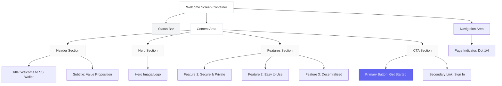
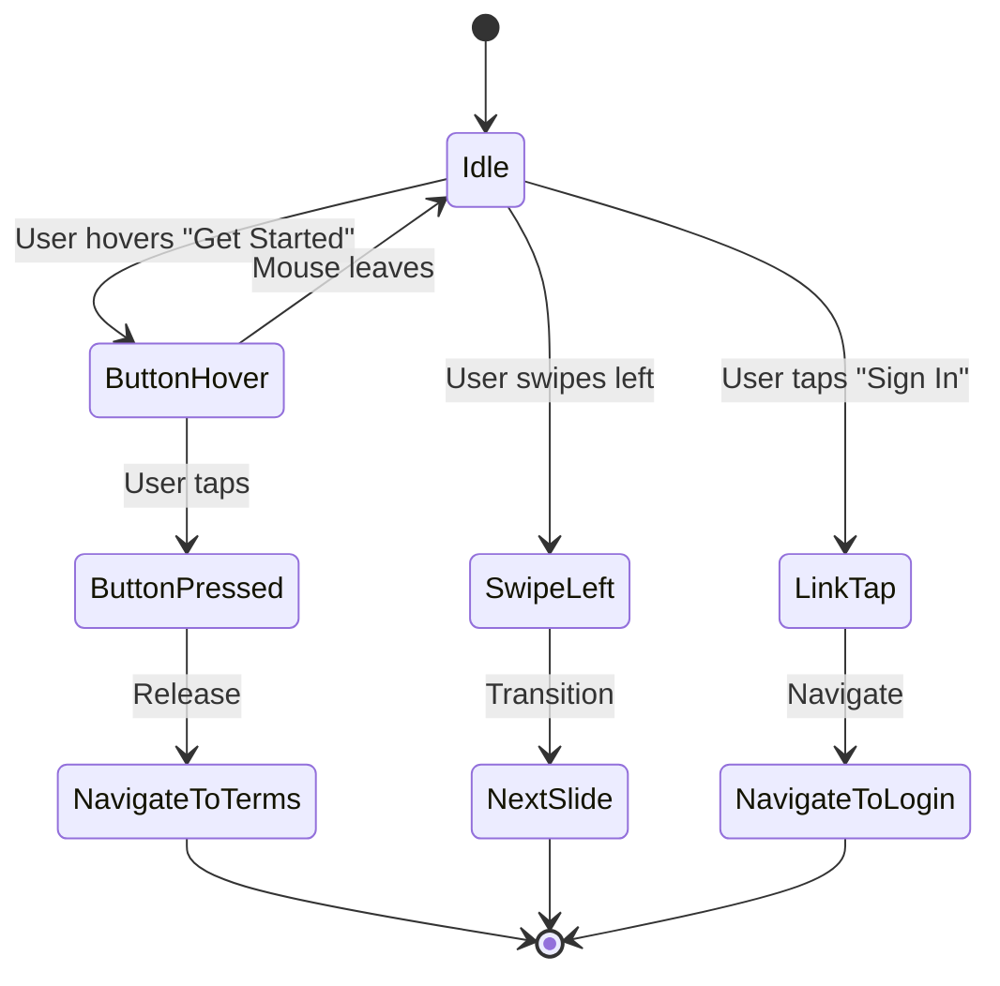
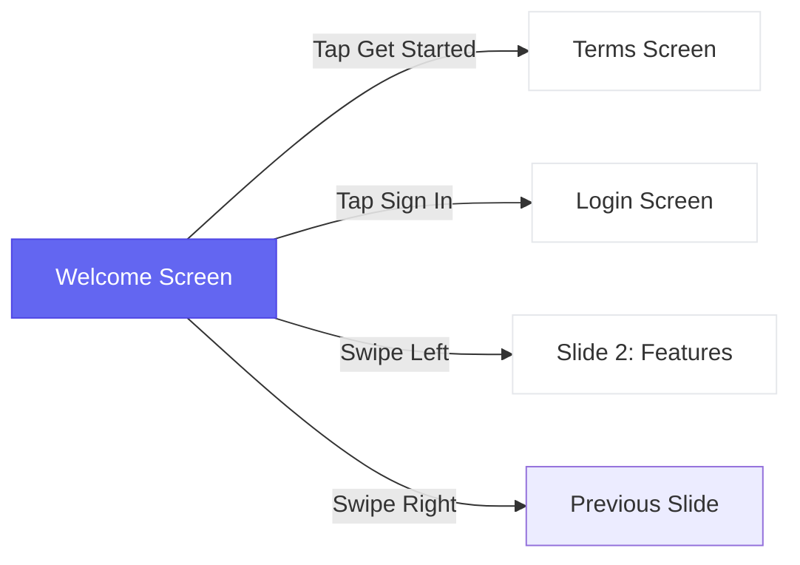

# Welcome Screen - Wireframe

**Screen**: Welcome (Onboarding Step 1)  
**Device**: iPhone (375 x 812 px)  
**File**: `src/screens/Onboarding/WelcomeScreen.tsx`

---

## Visual Wireframe

```
┌─────────────────────────────────────┐
│  ●●●                    🔋 📶 12:30 │ ← Status Bar (44px)
├─────────────────────────────────────┤
│                                     │
│                                     │ ← Safe Area Top (44px)
│          Welcome to                 │
│          SSI Wallet                 │ ← Title (18pt Bold)
│                                     │
│   Your digital identity, your control│ ← Subtitle (10pt)
│   Store credentials securely        │
│                                     │
│                                     │
│         ┌───────────┐               │
│         │           │               │
│         │   LOGO    │               │ ← Hero Image (200x200px)
│         │           │               │
│         └───────────┘               │
│                                     │
│                                     │
│       ✓ Secure & Private            │
│       ✓ Easy to Use                 │ ← Features (10pt)
│       ✓ Decentralized               │
│                                     │
│                                     │
│                                     │
│     ┌─────────────────────┐         │
│     │   Get Started       │         │ ← Primary Button (56px)
│     └─────────────────────┘         │
│                                     │
│  Already have an account? Sign In   │ ← Link (9pt)
│                                     │
│                                     │
│            ● ○ ○ ○                  │ ← Page Indicator
│                                     │
└─────────────────────────────────────┘ ← Safe Area Bottom (34px)
```

---

## Component Structure



---

## Layout Specifications

### Dimensions
| Element | Size |
|---------|------|
| Screen Width | 375px |
| Screen Height | 812px |
| Safe Area Top | 44px |
| Safe Area Bottom | 34px |
| Side Padding | 24px |
| Content Width | 327px |

### Typography
| Element | Font Size | Weight | Color |
|---------|-----------|--------|-------|
| Title | 18pt | Bold | #111827 |
| Subtitle | 10pt | Regular | #6B7280 |
| Features | 10pt | Regular | #374151 |
| Button Text | 14pt | Bold | #FFFFFF |
| Link | 9pt | Regular | #6366F1 |

### Spacing
| Element | Top | Bottom |
|---------|-----|--------|
| Title | 60px | 8px |
| Subtitle | 8px | 40px |
| Hero Image | 40px | 40px |
| Features | 40px | 60px |
| Button | 60px | 16px |
| Link | 16px | 32px |

### Components
| Component | Height | Border Radius | Background |
|-----------|--------|---------------|------------|
| Primary Button | 56px | 12px | #6366F1 |
| Hero Image | 200px | 16px | #F3F4F6 |
| Page Indicator | 8px | 4px (circle) | #D1D5DB |

---

## Interaction Flow



---

## Navigation Map



---

## Component Breakdown

### 1. Status Bar
- **Type**: System Component
- **Height**: 44px (iPhone X+)
- **Content**: Time, Signal, Battery, Notch
- **Background**: Transparent

### 2. Title Section
- **Alignment**: Center
- **Text**: "Welcome to SSI Wallet"
- **Font**: 18pt SF Pro Bold
- **Color**: #111827
- **Line Height**: 24px

### 3. Subtitle Section
- **Alignment**: Center
- **Text**: "Your digital identity, your control\nStore credentials securely"
- **Font**: 10pt SF Pro Regular
- **Color**: #6B7280
- **Line Height**: 16px

### 4. Hero Image
- **Size**: 200 x 200px
- **Position**: Center horizontally
- **Border Radius**: 16px
- **Background**: #F3F4F6 (placeholder)
- **Content**: Logo or illustration

### 5. Features List
- **Items**: 3 features with checkmarks
- **Icon**: ✓ (green #10B981)
- **Font**: 10pt SF Pro Regular
- **Color**: #374151
- **Spacing**: 12px between items

### 6. Primary Button
- **Label**: "Get Started"
- **Size**: 327 x 56px (full width - padding)
- **Background**: #6366F1 (Indigo)
- **Text Color**: #FFFFFF
- **Border Radius**: 12px
- **States**: 
  - Default: #6366F1
  - Pressed: #4F46E5
  - Disabled: #D1D5DB

### 7. Secondary Link
- **Label**: "Already have an account? Sign In"
- **Font**: 9pt SF Pro Regular
- **Colors**: Gray text + Indigo link
- **Underline**: On "Sign In" only
- **Action**: Navigate to Login

### 8. Page Indicator
- **Type**: Dots (4 total)
- **Size**: 8px diameter
- **Active**: Filled (#6366F1)
- **Inactive**: Outlined (#D1D5DB)
- **Spacing**: 8px between dots

---

## States & Behaviors

### Default State
- All elements visible
- Button enabled
- Page indicator shows dot 1/4

### Loading State
- Button shows spinner
- Button disabled
- Text: "Loading..."

### Error State
- Show error message below button
- Button enabled (retry)
- Red text: "Something went wrong"

### Success State
- Fade out animation
- Navigate to next screen
- 300ms transition

---

## Accessibility

### Screen Reader
- Title: "Welcome to S S I Wallet"
- Button: "Get Started button, navigates to Terms and Conditions"
- Link: "Already have an account? Sign In link"

### Dynamic Type
- Supports iOS text size scaling
- Min: 12pt, Max: 28pt
- Maintains layout proportions

### High Contrast
- Button: Border added
- Text: Increased weight
- Minimum contrast ratio: 4.5:1

### Touch Targets
- Minimum size: 44 x 44 pt
- Button: 327 x 56 px (meets requirement)
- Link: Expanded touch area

---

## Implementation Notes

### React Native Code Structure
```typescript
<SafeAreaView>
  <StatusBar />
  <ScrollView contentContainerStyle={styles.container}>
    <View style={styles.header}>
      <Text style={styles.title}>Welcome to SSI Wallet</Text>
      <Text style={styles.subtitle}>Your digital identity...</Text>
    </View>
    
    <View style={styles.hero}>
      <Image source={logo} style={styles.heroImage} />
    </View>
    
    <View style={styles.features}>
      <Feature icon="✓" text="Secure & Private" />
      <Feature icon="✓" text="Easy to Use" />
      <Feature icon="✓" text="Decentralized" />
    </View>
    
    <View style={styles.cta}>
      <Button onPress={handleGetStarted}>Get Started</Button>
      <Link onPress={handleSignIn}>Sign In</Link>
    </View>
    
    <PageIndicator current={0} total={4} />
  </ScrollView>
</SafeAreaView>
```

---

## Design Tokens

### Colors
```javascript
const colors = {
  primary: '#6366F1',      // Indigo
  primaryDark: '#4F46E5',  // Indigo Dark
  text: '#111827',         // Almost Black
  textSecondary: '#6B7280', // Gray
  background: '#FFFFFF',   // White
  border: '#E5E7EB',       // Light Gray
  success: '#10B981',      // Green
};
```

### Spacing
```javascript
const spacing = {
  xs: 4,
  sm: 8,
  md: 16,
  lg: 24,
  xl: 40,
  xxl: 60,
};
```

### Typography
```javascript
const typography = {
  title: { fontSize: 18, fontWeight: '700' },
  subtitle: { fontSize: 10, fontWeight: '400' },
  body: { fontSize: 10, fontWeight: '400' },
  button: { fontSize: 14, fontWeight: '700' },
  link: { fontSize: 9, fontWeight: '400' },
};
```

---

## Testing Checklist

- [ ] Renders correctly on iPhone SE (small screen)
- [ ] Renders correctly on iPhone 14 Pro Max (large screen)
- [ ] Button tap navigates to Terms screen
- [ ] Sign In link navigates to Login screen
- [ ] Swipe left shows next slide
- [ ] Page indicator updates correctly
- [ ] VoiceOver reads all elements
- [ ] Dynamic type scales properly
- [ ] High contrast mode works
- [ ] Dark mode compatible (future)

---

**Status**: ✅ Ready for Development  
**Last Updated**: 2024  
**Format**: Mermaid + ASCII Wireframe  
