# Terms & Privacy Screen - Wireframe

**Screen**: Terms & Privacy (Onboarding Step 2)  
**Device**: iPhone (375 x 812 px)  
**File**: `src/screens/Onboarding/TermsScreen.tsx`

---

## Visual Wireframe

```
┌─────────────────────────────────────┐
│  ← Back              12:30    🔋 📶 │ ← Navigation Bar
├─────────────────────────────────────┤
│                                     │
│          Terms & Privacy            │ ← Title (18pt Bold)
│                                     │
│   Please review and accept          │ ← Subtitle (10pt)
│                                     │
├─────────────────────────────────────┤
│                                     │
│  ┌─────────────────────────────┐   │
│  │ Terms of Service            │   │ ← Scrollable Content
│  │                             │   │
│  │ Last updated: Jan 2024      │   │
│  │                             │   │
│  │ 1. Your Rights              │   │
│  │ You own your data. We don't │   │
│  │ sell or share your personal │   │
│  │ information...              │   │
│  │                             │   │
│  │ 2. Our Responsibilities     │   │
│  │ We provide secure storage   │   │
│  │ for your credentials...     │   │
│  │                             │   │
│  │ 3. Privacy Policy           │   │
│  │ Your credentials stay on    │   │
│  │ your device. We use         │   │
│  │ encryption...               │   │
│  │                             │   │
│  │ [View Full Terms →]         │   │
│  └─────────────────────────────┘   │
│                                     │
├─────────────────────────────────────┤
│                                     │
│  ☑ I accept Terms of Service       │ ← Required Checkbox
│                                     │
│  ☑ I accept Privacy Policy          │ ← Required Checkbox
│                                     │
│  ☐ Send me updates (optional)      │ ← Optional Checkbox
│                                     │
├─────────────────────────────────────┤
│                                     │
│     ┌─────────────────────┐         │
│     │      Accept         │         │ ← Primary Button
│     └─────────────────────┘         │
│                                     │
│            ○ ● ○ ○                  │ ← Page Indicator (2/4)
│                                     │
└─────────────────────────────────────┘
```

---

## Component Structure

```mermaid
graph TD
    A[Terms Screen Container] --> B[Navigation Bar]
    A --> C[Header Section]
    A --> D[Content Section]
    A --> E[Acceptance Section]
    A --> F[Action Section]
    
    B --> B1[Back Button]
    
    C --> C1[Title: Terms & Privacy]
    C --> C2[Subtitle: Please review...]
    
    D --> D1[ScrollView: Terms Content]
    D1 --> D1A[Section 1: Your Rights]
    D1 --> D1B[Section 2: Our Responsibilities]
    D1 --> D1C[Section 3: Privacy Policy]
    D1 --> D1D[Link: View Full Terms]
    
    E --> E1[Checkbox: Terms of Service ✓]
    E --> E2[Checkbox: Privacy Policy ✓]
    E --> E3[Checkbox: Updates Optional]
    
    F --> F1[Primary Button: Accept]
    F --> F2[Page Indicator: 2/4]
    
    style A fill:#ffffff,stroke:#e5e7eb,stroke-width:2px
    style D1 fill:#f9fafb,stroke:#e5e7eb
    style E1 fill:#10b981,stroke:#059669,color:#ffffff
    style E2 fill:#10b981,stroke:#059669,color:#ffffff
    style F1 fill:#6366f1,stroke:#4f46e5,color:#ffffff
```



---

## Interaction Flow


---

## Layout Specifications

### Dimensions
| Element | Size |
|---------|------|
| Navigation Bar | 44px height |
| Content Area | Scrollable |
| Checkbox Row | 48px height |
| Button Height | 56px |

### Typography
| Element | Font Size | Weight | Color |
|---------|-----------|--------|-------|
| Title | 18pt | Bold | #111827 |
| Subtitle | 10pt | Regular | #6B7280 |
| Terms Content | 9pt | Regular | #374151 |
| Checkbox Label | 10pt | Regular | #111827 |
| Button Text | 14pt | Bold | #FFFFFF |

### Components
| Component | Height | State Colors |
|-----------|--------|--------------|
| Checkbox (unchecked) | 24x24px | Border: #D1D5DB |
| Checkbox (checked) | 24x24px | Fill: #10B981 |
| Accept Button (disabled) | 56px | #D1D5DB |
| Accept Button (enabled) | 56px | #6366F1 |

---

## Navigation Map


---

## Component Breakdown

### 1. Navigation Bar
- **Back Button**: "<- Back" (tap returns to Welcome)
- **Title**: Optional center title
- **Height**: 44px

### 2. Header Section
- **Title**: "Terms & Privacy"
- **Subtitle**: "Please review and accept"
- **Alignment**: Center

### 3. Terms Content (ScrollView)
- **Background**: #F9FAFB (light gray)
- **Padding**: 16px
- **Border Radius**: 12px
- **Height**: Auto (scrollable)
- **Content**: Summarized terms (3 sections)
- **Link**: "View Full Terms →" opens modal

### 4. Checkbox Group
- **Required Checkboxes** (2):
  - Terms of Service
  - Privacy Policy
  - Both must be checked to enable button
- **Optional Checkbox** (1):
  - Send me updates
  - Can proceed without checking
- **Spacing**: 16px between rows
- **Touch Target**: 48px height (entire row tappable)

### 5. Accept Button
- **Label**: "Accept"
- **States**:
  - Disabled: #D1D5DB (gray) - when checkboxes not checked
  - Enabled: #6366F1 (indigo) - when both required checked
  - Pressed: #4F46E5 (darker indigo)
- **Action**: Save acceptance state to Redux, navigate to next screen

### 6. Page Indicator
- **Position**: 2 of 4
- **Active Dot**: Filled (#6366F1)
- **Inactive Dots**: Outlined (#D1D5DB)

---

## States & Behaviors

### Initial State
- Both required checkboxes unchecked
- Optional checkbox unchecked
- Accept button disabled (gray)
- Cannot proceed

### Partial State
- One required checkbox checked
- Accept button still disabled
- Visual feedback on checked items

### Ready State
- Both required checkboxes checked
- Accept button enabled (indigo)
- Can proceed to next screen

### Loading State
- Accept button shows spinner
- Checkboxes disabled
- Text: "Saving..."

### Error State
- Show error message: "Failed to save. Please try again."
- Button re-enabled for retry

---

## Redux Integration

### State Management
```typescript
// Redux slice: onboardingSlice
interface OnboardingState {
  termsAccepted: boolean;
  privacyAccepted: boolean;
  marketingConsent: boolean;
  acceptedAt: string | null;
}

// Actions
const acceptTerms = () => {
  dispatch(setTermsAccepted(true));
  dispatch(setPrivacyAccepted(true));
  dispatch(setAcceptedAt(new Date().toISOString()));
};
```

---

## Implementation Notes

### React Native Code
```typescript
const TermsScreen = () => {
  const [termsChecked, setTermsChecked] = useState(false);
  const [privacyChecked, setPrivacyChecked] = useState(false);
  const [marketingChecked, setMarketingChecked] = useState(false);
  
  const canProceed = termsChecked && privacyChecked;
  
  const handleAccept = async () => {
    await dispatch(acceptTerms());
    navigation.navigate('PersonalDetails');
  };
  
  return (
    <SafeAreaView>
      <NavigationBar onBack={() => navigation.goBack()} />
      <Header title="Terms & Privacy" />
      <ScrollView style={styles.content}>
        <TermsContent />
      </ScrollView>
      <CheckboxGroup>
        <Checkbox 
          checked={termsChecked} 
          onChange={setTermsChecked}
          label="I accept Terms of Service"
          required
        />
        <Checkbox 
          checked={privacyChecked} 
          onChange={setPrivacyChecked}
          label="I accept Privacy Policy"
          required
        />
        <Checkbox 
          checked={marketingChecked} 
          onChange={setMarketingChecked}
          label="Send me updates (optional)"
        />
      </CheckboxGroup>
      <Button 
        onPress={handleAccept} 
        disabled={!canProceed}
      >
        Accept
      </Button>
      <PageIndicator current={1} total={4} />
    </SafeAreaView>
  );
};
```

---

## Accessibility

### Screen Reader
- "Terms and Privacy screen"
- "Checkbox unchecked, required: I accept Terms of Service"
- "Checkbox checked, required: I accept Privacy Policy"
- "Accept button, disabled" / "Accept button, navigates to personal details"

### Touch Targets
- Entire checkbox row: 48px height (tappable)
- Checkbox itself: 24x24px (visual)
- Link: 44px height minimum

---

## Testing Checklist

- [ ] Back button returns to Welcome
- [ ] Checkboxes toggle correctly
- [ ] Button disabled when required unchecked
- [ ] Button enabled when both required checked
- [ ] Optional checkbox doesn't affect button state
- [ ] Accept saves state to Redux
- [ ] Accept navigates to Personal Details
- [ ] View Full Terms opens modal
- [ ] ScrollView scrolls smoothly
- [ ] Page indicator shows 2/4

---

**Status**: ✅ Ready for Development  
**Dependencies**: Redux store, Navigation  
**Next Screen**: Personal Details (03)
