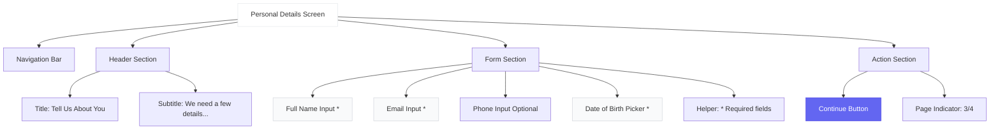
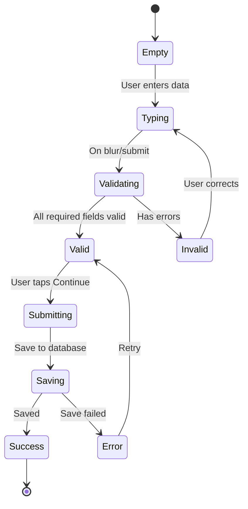

# Personal Details Screen - Wireframe

**Screen**: Personal Details (Onboarding Step 3)  
**Device**: iPhone (375 x 812 px)  
**File**: `src/screens/Onboarding/PersonalDetailsScreen.tsx`

---

## Visual Wireframe

```
┌─────────────────────────────────────┐
│  ← Back              12:30    🔋 📶 │
├─────────────────────────────────────┤
│                                     │
│        Tell Us About You            │ ← Title (18pt)
│                                     │
│   We need a few details to get      │ ← Subtitle (10pt)
│   your wallet set up                │
│                                     │
├─────────────────────────────────────┤
│                                     │
│  Full Name *                        │ ← Label
│  ┌─────────────────────────────┐   │
│  │ John Doe                    │   │ ← Text Input
│  └─────────────────────────────┘   │
│                                     │
│  Email Address *                    │
│  ┌─────────────────────────────┐   │
│  │ john@example.com            │   │
│  └─────────────────────────────┘   │
│                                     │
│  Phone Number (Optional)            │
│  ┌─────────────────────────────┐   │
│  │ +1 (555) 123-4567           │   │
│  └─────────────────────────────┘   │
│                                     │
│  Date of Birth *                    │
│  ┌─────────────────────────────┐   │
│  │ MM / DD / YYYY              │   │ ← Date Picker
│  └─────────────────────────────┘   │
│                                     │
│  * Required fields                  │ ← Helper Text
│                                     │
├─────────────────────────────────────┤
│                                     │
│     ┌─────────────────────┐         │
│     │     Continue        │         │ ← Primary Button
│     └─────────────────────┘         │
│                                     │
│            ○ ○ ● ○                  │ ← Page Indicator (3/4)
│                                     │
└─────────────────────────────────────┘
```

---

## Component Structure



---

## Form Validation



---

## Form Fields

### 1. Full Name
- **Type**: Text input
- **Required**: Yes
- **Validation**: Min 2 characters, letters only
- **Placeholder**: "John Doe"
- **Error**: "Name must be at least 2 characters"

### 2. Email Address  
- **Type**: Email input
- **Required**: Yes
- **Validation**: Valid email format
- **Placeholder**: "john@example.com"
- **Keyboard**: Email keyboard
- **Error**: "Please enter a valid email"

### 3. Phone Number
- **Type**: Phone input  
- **Required**: No
- **Validation**: Valid phone format (if entered)
- **Placeholder**: "+1 (555) 123-4567"
- **Keyboard**: Phone keyboard
- **Mask**: Auto-format as user types

### 4. Date of Birth
- **Type**: Date picker
- **Required**: Yes
- **Validation**: Must be 18+ years old
- **Format**: MM/DD/YYYY
- **Error**: "You must be 18 or older"

---

## Implementation

```typescript
// Form validation with Zod
const schema = z.object({
  fullName: z.string().min(2, "Name must be at least 2 characters"),
  email: z.string().email("Please enter a valid email"),
  phone: z.string().optional(),
  dateOfBirth: z.date().refine(
    (date) => {
      const age = new Date().getFullYear() - date.getFullYear();
      return age >= 18;
    },
    "You must be 18 or older"
  ),
});

// React Hook Form
const { control, handleSubmit, formState: { errors } } = useForm({
  resolver: zodResolver(schema),
});

const onSubmit = async (data) => {
  await database.users.save(data);
  navigation.navigate('PINSetup');
};
```

---

**Status**: ✅ Ready  
**Next**: PIN Setup (04)
