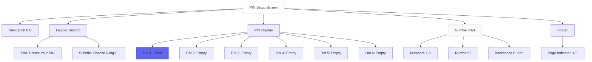
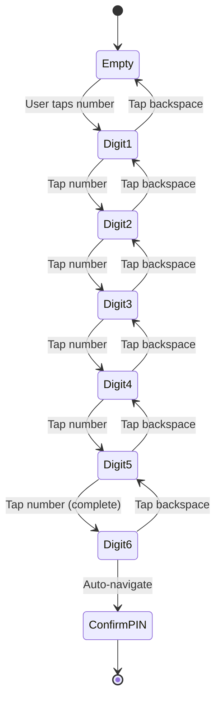

# PIN Setup Screen - Wireframe

**Screen**: PIN Setup (Onboarding Step 4)  
**Device**: iPhone (375 x 812 px)  
**File**: `src/screens/Onboarding/PINSetupScreen.tsx`

---

## Visual Wireframe

```
┌─────────────────────────────────────┐
│  ← Back              12:30    🔋 📶 │
├─────────────────────────────────────┤
│                                     │
│          Create Your PIN            │ ← Title (18pt)
│                                     │
│   Choose a 6-digit PIN to secure    │ ← Subtitle
│   your wallet                       │
│                                     │
│                                     │
│                                     │
│        ●  ○  ○  ○  ○  ○             │ ← PIN Dots (1/6 filled)
│                                     │
│                                     │
│                                     │
│                                     │
│     ┌───┬───┬───┐                  │
│     │ 1 │ 2 │ 3 │                  │ ← Number Pad
│     ├───┼───┼───┤                  │
│     │ 4 │ 5 │ 6 │                  │
│     ├───┼───┼───┤                  │
│     │ 7 │ 8 │ 9 │                  │
│     ├───┼───┼───┤                  │
│     │   │ 0 │ ⌫ │                  │ ← Backspace
│     └───┴───┴───┘                  │
│                                     │
│                                     │
│            ○ ○ ○ ● ○                │ ← Page Indicator (4/5)
│                                     │
└─────────────────────────────────────┘
```

---

## Component Structure



---

## PIN Entry Flow



---

## Layout Specifications

### PIN Dots
| Element | Size | Spacing | Color (Empty) | Color (Filled) |
|---------|------|---------|---------------|----------------|
| Dot | 16px diameter | 16px between | #E5E7EB | #6366F1 |

### Number Pad
| Element | Size | Spacing |
|---------|------|---------|
| Button | 72x72px | 12px gap |
| Font Size | 24pt | Bold |
| Touch Target | 72x72px | Full button |

---

## Implementation

```typescript
const PINSetupScreen = () => {
  const [pin, setPIN] = useState('');
  
  const handleNumber = (num: string) => {
    if (pin.length < 6) {
      const newPIN = pin + num;
      setPIN(newPIN);
      
      // Haptic feedback
      Haptics.selectionAsync();
      
      // Auto-navigate when complete
      if (newPIN.length === 6) {
        navigation.navigate('PINConfirm', { pin: newPIN });
      }
    }
  };
  
  const handleBackspace = () => {
    setPIN(pin.slice(0, -1));
  };
  
  return (
    <View>
      <Header title="Create Your PIN" />
      <PINDots filled={pin.length} total={6} />
      <NumberPad 
        onNumber={handleNumber} 
        onBackspace={handleBackspace}
      />
    </View>
  );
};
```

---

**Status**: ✅ Ready  
**Next**: PIN Confirm → Biometric Setup
