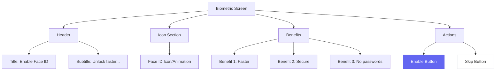

# Biometric Setup Screen - Wireframe

**Screen**: Biometric Setup (Onboarding Step 5)  
**Device**: iPhone (375 x 812 px)  
**File**: `src/screens/Onboarding/BiometricSetupScreen.tsx`

---

## Visual Wireframe

```
┌─────────────────────────────────────┐
│  ← Back              12:30    🔋 📶 │
├─────────────────────────────────────┤
│                                     │
│        Enable Face ID               │ ← Title
│                                     │
│   Unlock your wallet faster         │ ← Subtitle
│   with Face ID                      │
│                                     │
│                                     │
│         ┌───────────┐               │
│         │           │               │
│         │   Face    │               │ ← Icon/Animation
│         │    ID     │               │
│         │           │               │
│         └───────────┘               │
│                                     │
│                                     │
│   Why use Face ID?                  │ ← Benefits Section
│                                     │
│   ✓ Faster unlock                   │
│   ✓ More secure                     │
│   ✓ No passwords                    │
│                                     │
│                                     │
│     ┌─────────────────────┐         │
│     │   Enable Face ID    │         │ ← Primary Button
│     └─────────────────────┘         │
│                                     │
│     ┌─────────────────────┐         │
│     │    Skip for Now     │         │ ← Secondary Button
│     └─────────────────────┘         │
│                                     │
│            ○ ○ ○ ○ ●                │ ← Page Indicator (5/5)
│                                     │
└─────────────────────────────────────┘
```

---

## Component Structure



---

## Implementation

```typescript
const BiometricSetupScreen = () => {
  const handleEnable = async () => {
    const result = await LocalAuthentication.authenticateAsync({
      promptMessage: 'Enable Face ID',
    });
    
    if (result.success) {
      await SecureStore.setItemAsync('biometric_enabled', 'true');
      navigation.navigate('OnboardingComplete');
    }
  };
  
  const handleSkip = () => {
    navigation.navigate('OnboardingComplete');
  };
};
```

---

**Status**: ✅ Ready  
**Optional**: User can skip
