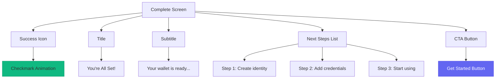

# Onboarding Complete Screen - Wireframe

**Screen**: Onboarding Complete  
**Device**: iPhone (375 x 812 px)  
**File**: `src/screens/Onboarding/OnboardingCompleteScreen.tsx`

---

## Visual Wireframe

```
┌─────────────────────────────────────┐
│                 12:30           🔋 📶│
├─────────────────────────────────────┤
│                                     │
│                                     │
│                                     │
│              ┌─────┐                │
│              │  ✓  │                │ ← Success Icon
│              └─────┘                │
│                                     │
│          You're All Set!            │ ← Title (20pt Bold)
│                                     │
│   Your wallet is ready to use       │ ← Subtitle
│                                     │
│                                     │
│   What's next:                      │ ← Next Steps
│                                     │
│   1. Create your first identity     │
│   2. Add credentials                │
│   3. Start using your wallet        │
│                                     │
│                                     │
│     ┌─────────────────────┐         │
│     │    Get Started      │         │ ← Primary CTA
│     └─────────────────────┘         │
│                                     │
│                                     │
│                                     │
└─────────────────────────────────────┘
```

---

## Component Structure



---

**Status**: ✅ Ready  
**Next**: Navigate to Home Dashboard
