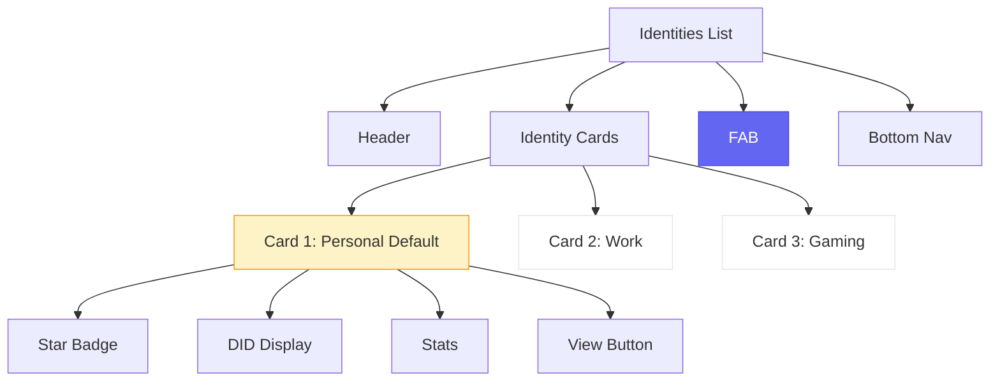

# Identities List Screen - Wireframe

**Screen**: Identities List (Phase 2)  
**Device**: iPhone (375 x 812 px)  
**File**: `src/screens/Identities/IdentitiesListScreen.tsx`

---

## Visual Wireframe

```
┌─────────────────────────────────────┐
│  Identities          12:30    🔋 📶 │ ← Title + Status
├─────────────────────────────────────┤
│                                     │
│  ┌───────────────────────────────┐ │
│  │ ⭐ Personal Identity          │ │ ← Identity Card (Default)
│  │                               │ │
│  │ did:jwk:eyJr...               │ │ ← DID (truncated)
│  │                               │ │
│  │ 2 keys  •  5 credentials      │ │ ← Stats
│  │                               │ │
│  │ [View Details]                │ │ ← Action
│  └───────────────────────────────┘ │
│                                     │
│  ┌───────────────────────────────┐ │
│  │ Work Identity                 │ │ ← Identity Card
│  │                               │ │
│  │ did:jwk:abc123...             │ │
│  │                               │ │
│  │ 1 key  •  0 credentials       │ │
│  │                               │ │
│  │ [View Details] [Set Default]  │ │
│  └───────────────────────────────┘ │
│                                     │
│  ┌───────────────────────────────┐ │
│  │ Gaming Identity               │ │
│  │                               │ │
│  │ did:key:z6Mk...               │ │
│  │                               │ │
│  │ 1 key  •  2 credentials       │ │
│  │                               │ │
│  │ [View Details] [Set Default]  │ │
│  └───────────────────────────────┘ │
│                                     │
│     ┌─────────────────────┐         │
│     │  + Create Identity  │         │ ← FAB
│     └─────────────────────┘         │
│                                     │
└─────────────────────────────────────┘
│  🏠   🎭   🎫   👤                  │ ← Bottom Nav (Identities active)
└─────────────────────────────────────┘
```

---

## Component Structure



---

**Status**: ✅ Ready  
**Features**: List, Default indicator, Create new
